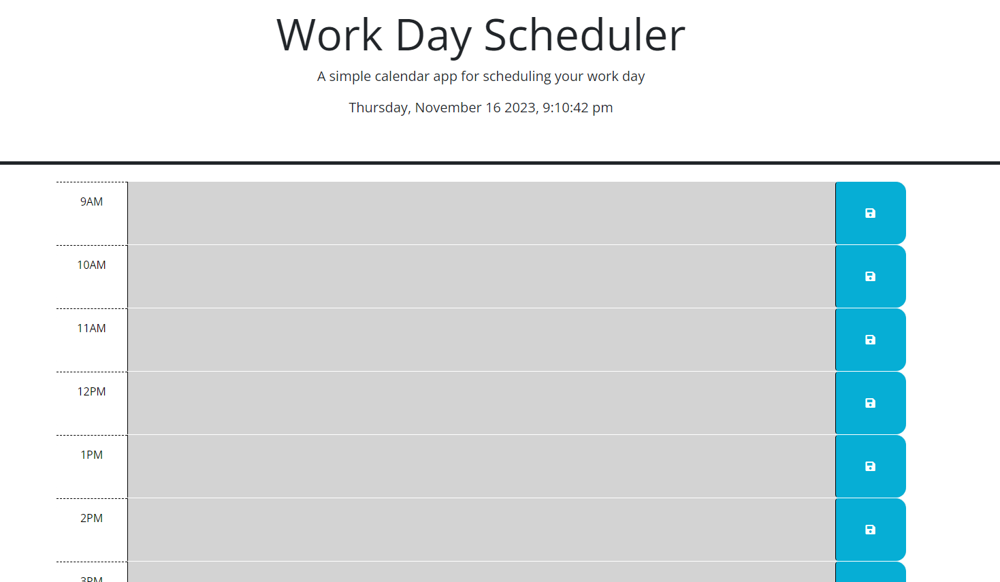
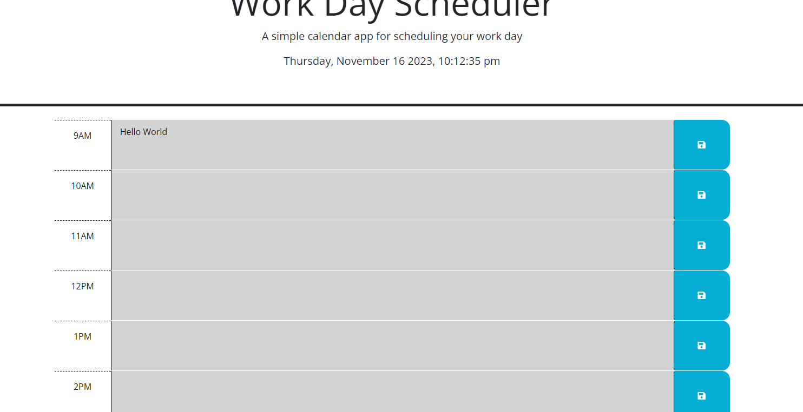

# Event-Calender
## User Story

```md
AS AN employee with a busy schedule
I WANT to add important events to a daily planner
SO THAT I can manage my time effectively
```

## Acceptance Criteria

```md
GIVEN I am using a daily planner to create a schedule
WHEN I open the planner
THEN the current day is displayed at the top of the calendar
WHEN I scroll down
THEN I am presented with timeblocks for standard business hours of 9am&ndash;5pm
WHEN I view the timeblocks for that day
THEN each timeblock is color coded to indicate whether it is in the past, present, or future
WHEN I click into a timeblock
THEN I can enter an event
WHEN I click the save button for that timeblock
THEN the text for that event is saved in local storage
WHEN I refresh the page
THEN the saved events persist
```

## Description
```md
I first made it so that the current local time was shown on the page to have the correct date and time for
the calander.

I then used the save buttons to figure out which ones was being clicked using an array for the class. Which
I was then shown a better was using This and on click to get the button being used. Which I then made the 
button being clicked find the parent and the text area so that it saves the value and stores it in local 
storage to appear when page is reloaded.

I also made the time on the calander show through colors with current time shown in red if time is show on 
calander. Any time less than the current time and it'll show grey and any time more than the current time will 
appear as green to show time left in the day.
```

## Images
```md



```

## Links
```md
Website: [Link text](https://christopher-va.github.io/Event-Calender/)
Github: [Link text](https://github.com/Christopher-VA/Event-Calender)
```